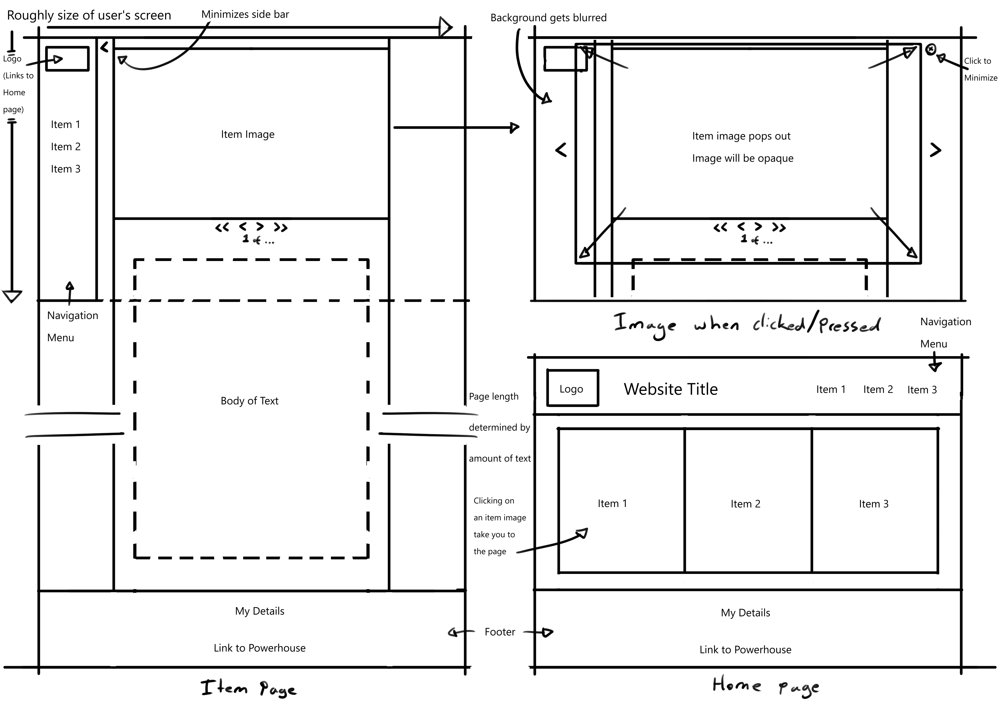
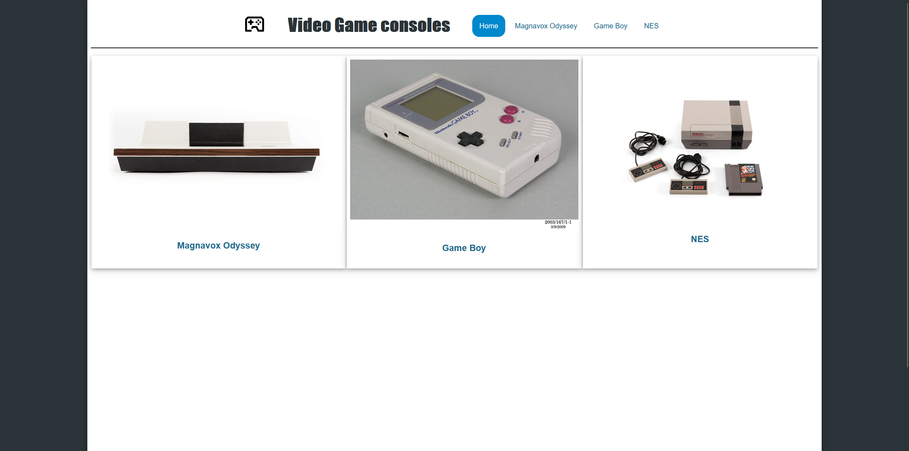
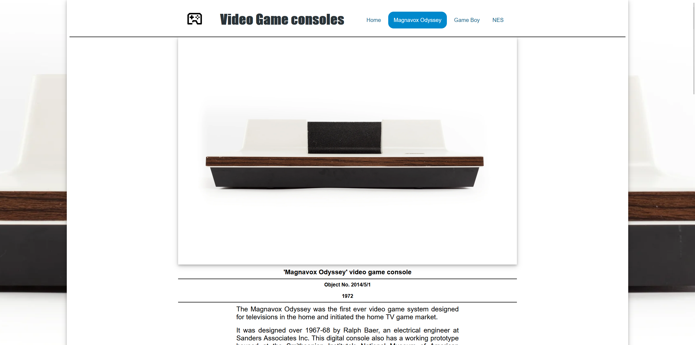
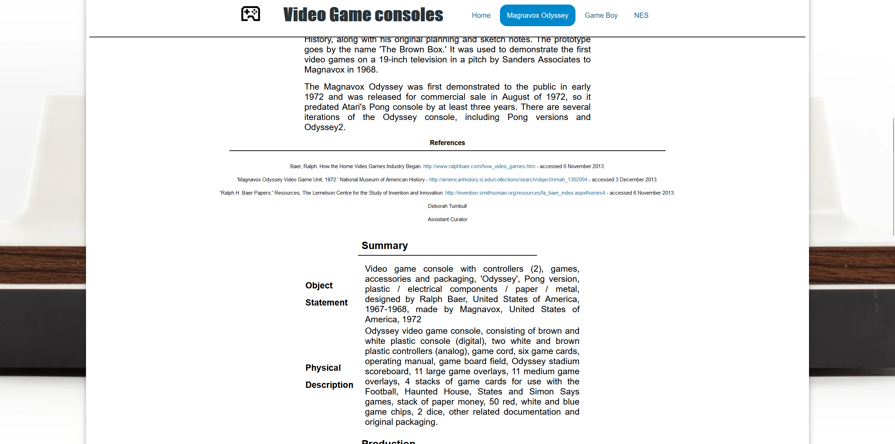

# Rationale
## Project name/topic
### Describe your project and its aim.
The topic I chose to base my website on is that of a collection of game consoles from the Powerhouse collection. The reason for this is that it is an area that I have personal interest in, furthermore, when initially designing my site I believed that it was a strong theme that I can develop a website around. 

## Project details - what did you do, and why
### Don't forget, this is interaction design, so explain how your site works for the user.
This site is very simple

## Comparison to initial wireframes
### Use images (for code see markdown tutorial in module 11) of wireframes and screenshots of your finished site.

# Resources / References 
### A list of resources you used and a brief explanation of how and where you used them. This includes any code snippets and video tutorials.
### If you're using academic references in this document, add them in APA format, separately to the resources.

W3 Schools (https://www.w3schools.com/html/html_tables.asp) is a resource 